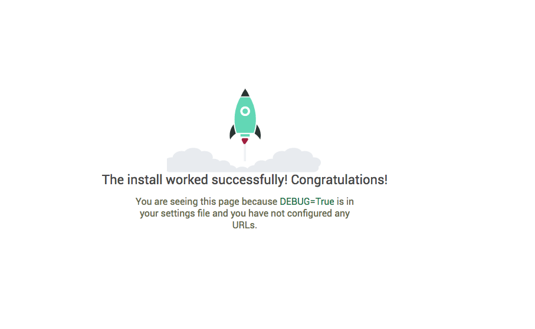

- [Інтродукції](#introduction)
  - [is](#is)
  - [a](#a)
    - [foo](#foo)
    - [foo](#foo-1)
  - [file](#file)
  - [bye](#bye)
- [bye](#bye-1)


# Створення API за допомогою Django та Django Rest Framework
Створення API за допомогою Django та DRF займає місце, де закінчуються навчальні посібники з Django. У підручниках Django ви створили звичайну програму опитування Django. Ми перебудуємо API для схожої програми. 

У наступних розділах ми створимо REST(ish) API з авторизацією, обмеженням швидкості, спочатку з чистим Django, а потім з DRF. Ми розглянемо тестування, безперервну інтеграцію, інструменти документування та інструменти співпраці API.

---
# Інтродукції
Створення API за допомогою Django та Django Rest Framework починається там, де закінчується підручник "Опитування" Django, і проведе вас через створення додатку для опитувань, але цього разу з використанням API. Ви вивчите основи Django Rest Framework, включаючи серіалізацію, перегляди, загальні перегляди, набори переглядів, тестування, контроль доступу. Ви також дізнаєтеся про документацію API за допомогою swagger і raml.

## Для кого ця книга?
Якщо ви закінчили підручник Django "Опитування" і хочете навчитися використовувати ФПІ для створення API, ця книга ідеально підходить для вас. Ця книга передбачає певні знання Django та Python, які ви повинні були створити, якщо закінчили турторіал "Опитування". Жодних знань про ФПІ не передбачається.

## Як читати цю книгу?
Розділи призначені для читання по порядку. Якщо у вас є знання про деякі розділи, ви можете швидко переглянути цей розділ, але я настійно рекомендую прочитати їх по порядку, оскільки кожен розділ спирається на попередній.

---
# Налаштування, моделі та адміністрування
У цьому посібнику ми розглянемо процес створення API для базової програми опитування. Ми будемо використовувати Python 3.6.x, Django 2.0.x і Django Rest Framework 3.7.x для створення API. 

Перш за все, давайте встановимо необхідні модулі у віртуальному середовищі.
```shell
mkvirtualenv pollsapi
pip install Django
pip install djangorestframework
```

## Створення проекту 
Перш за все, щоб створити проект, ми повинні перейти до каталогу, де ми хочемо зберегти наш код. Для цього перейдіть до командного рядка та скористайтеся командою cd. Потім запустіть команду startproject.
```shell
django-admin startproject pollsapi
```
Ця команда дає нам каталог «pollsapi». Вміст цього каталогу виглядає так:
```text
manage.py

pollsapi/
    __init__.py
    settings.py
    urls.py
    wsgi.py
```
## Налаштування бази даних
Ми будемо використовувати базу даних SQlite, яка вже включена в Python. Файл `pollsapi/settings.py` уже мав би правильні налаштування.
```python
DATABASES = {
    'default': {
        'ENGINE': 'django.db.backends.sqlite3',
        'NAME': os.path.join(BASE_DIR, 'db.sqlite3'),
    }
}
```
Тепер скористайтеся командою migrate, яка створює необхідні таблиці бази даних щодо файлу `django_pollsapi/settings.py`.
```shell
python manage.py migrate
```

## Створення моделей
Перш ніж створювати наші моделі бази даних, створимо додаток pollsapi.
```shell
python manage.py startapp polls
```

Наведена вище команда призводить до створення каталогу «polls», що містить різні файли:
```text
admin.py
apps.py
models.py
tests.py
views.py
```
Перейдіть до файлу 'models.py' і почніть писати моделі. 
Для створення API опитувань ми створимо модель опитування `Poll`, модель вибору `Choice` та модель голосування `Vote`.
Після того, як ми закінчимо розробляти наші моделі, файл `models.py` має виглядати так:

Ці моделі такі ж, як ви могли б побачити у вступному посібнику Django.
```python
from django.db import models
from django.contrib.auth.models import User


class Poll(models.Model):
    question = models.CharField(max_length=100)
    created_by = models.ForeignKey(User, on_delete=models.CASCADE)
    pub_date = models.DateTimeField(auto_now=True)

    def __str__(self):
        return self.question


class Choice(models.Model):
    poll = models.ForeignKey(Poll, related_name='choices', on_delete=models.CASCADE)
    choice_text = models.CharField(max_length=100)

    def __str__(self):
        return self.choice_text


class Vote(models.Model):
    choice = models.ForeignKey(Choice, related_name='votes', on_delete=models.CASCADE)
    poll = models.ForeignKey(Poll, on_delete=models.CASCADE)
    voted_by = models.ForeignKey(User, on_delete=models.CASCADE)

    class Meta:
        unique_together = ("poll", "voted_by")
```
Вищезазначені моделі були розроблені таким чином, що це зробило б наш API плавним процесом.

## Активація моделей 
За допомогою простих рядків коду в 'models.py' Django може створити схему бази даних і API доступу до бази даних Python,
який має можливість доступу до об’єктів Poll, Choice, Vote. Щоб створити таблиці бази даних для наших моделей, 
програми 'rest_framework' і 'polls' потрібно додати до 'INSTALLED_APPS' у файлі 'django_pollsapi/settings'.

```python
INSTALLED_APPS = (
...
'rest_framework',
'polls',
)
```
Тепер запустіть команду `makemigrations`, яка сповістить Django про те, що було створено нові моделі та ці зміни потрібно застосувати до міграції. 
Виконайте команду `migrate`, щоб виконати фактичне перенесення.
```shell
python manage.py makemigrations polls

python manage.py migrate
```
Створіть порожній `urls.py` у своїй програмі для опитувань.
```python
urlpatterns = [

]
```
Перейдіть до `pollsapi/urls.py` і додайте URL-адреси опитувань.
```python
from django.urls import include, re_path

urlpatterns = [
    re_path(r'^', include('polls.urls')),
]
```
Тепер ви можете запустити сервер
```shell
python manage.py runserver
```
Перейдіть у будь-який браузер на ваш вибір і натисніть URL-адресу `http://127.0.0.1:8000`

І ми в бізнесі, нас вітає сторінка Django *Congratulations*. (Хоча ми ще не додали жодних кінцевих точок API.)

---
asd