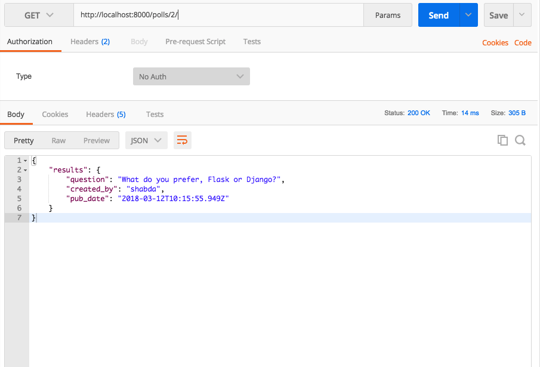
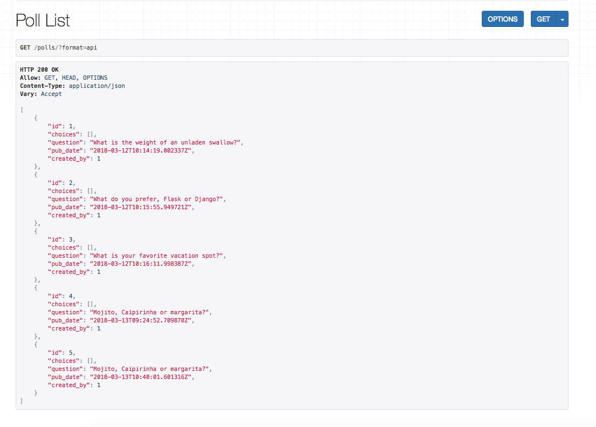
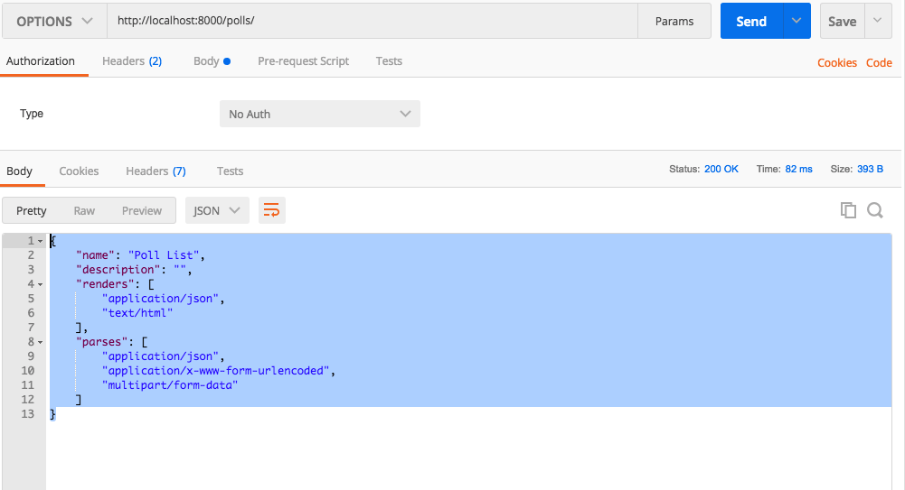
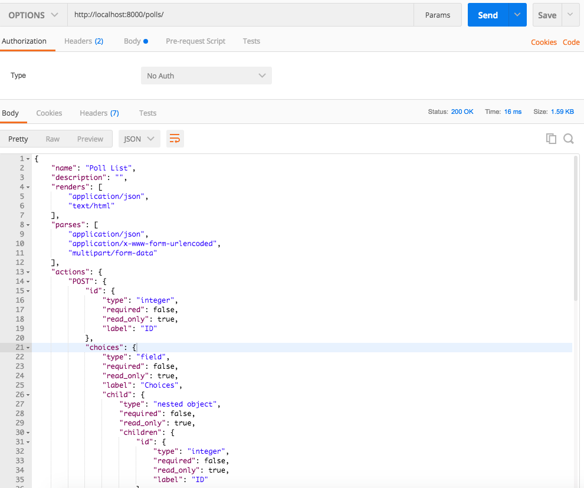

[comment]: <> (створити алгоритм для створеня меню)

# Створення API за допомогою Django та Django Rest Framework
Створення API за допомогою Django та DRF займає місце, де закінчуються навчальні посібники з Django. У підручниках Django ви створили звичайну програму опитування Django. Ми перебудуємо API для схожої програми. 

У наступних розділах ми створимо REST(ish) API з авторизацією, обмеженням швидкості, спочатку з чистим Django, а потім з DRF. Ми розглянемо тестування, безперервну інтеграцію, інструменти документування та інструменти співпраці API.

---
# Інтродукції
Створення API за допомогою Django та Django Rest Framework починається там, де закінчується підручник "Опитування" Django, і проведе вас через створення додатку для опитувань, але цього разу з використанням API. Ви вивчите основи Django Rest Framework, включаючи серіалізацію, перегляди, загальні перегляди, набори переглядів, тестування, контроль доступу. Ви також дізнаєтеся про документацію API за допомогою swagger і raml.

##  Для кого ця книга?
Якщо ви закінчили підручник Django "Опитування" і хочете навчитися використовувати ФПІ для створення API, ця книга ідеально підходить для вас. Ця книга передбачає певні знання Django та Python, які ви повинні були створити, якщо закінчили турторіал "Опитування". Жодних знань про ФПІ не передбачається.

##  Як читати цю книгу?
Розділи призначені для читання по порядку. Якщо у вас є знання про деякі розділи, ви можете швидко переглянути цей розділ, але я настійно рекомендую прочитати їх по порядку, оскільки кожен розділ спирається на попередній.

---
# Налаштування, моделі та адміністрування
У цьому посібнику ми розглянемо процес створення API для базової програми опитування. Ми будемо використовувати Python 3.6.x, Django 2.0.x і Django Rest Framework 3.7.x для створення API. 

Перш за все, давайте встановимо необхідні модулі у віртуальному середовищі.
```shell
mkvirtualenv pollsapi
pip install Django
pip install djangorestframework
```

##  Створення проекту 
Перш за все, щоб створити проект, ми повинні перейти до каталогу, де ми хочемо зберегти наш код. Для цього перейдіть до командного рядка та скористайтеся командою cd. Потім запустіть команду startproject.
```shell
django-admin startproject pollsapi
```
Ця команда дає нам каталог «pollsapi». Вміст цього каталогу виглядає так:
```text
manage.py

pollsapi/
    __init__.py
    settings.py
    urls.py
    wsgi.py
```
## Налаштування бази даних
Ми будемо використовувати базу даних SQlite, яка вже включена в Python. Файл `pollsapi/settings.py` уже мав би правильні налаштування.
```python
DATABASES = {
    'default': {
        'ENGINE': 'django.db.backends.sqlite3',
        'NAME': os.path.join(BASE_DIR, 'db.sqlite3'),
    }
}
```
Тепер скористайтеся командою migrate, яка створює необхідні таблиці бази даних щодо файлу `django_pollsapi/settings.py`.
```shell
python manage.py migrate
```

## Створення моделей
Перш ніж створювати наші моделі бази даних, створимо додаток pollsapi.
```shell
python manage.py startapp polls
```

Наведена вище команда призводить до створення каталогу «polls», що містить різні файли:
```text
admin.py
apps.py
models.py
tests.py
views.py
```
Перейдіть до файлу 'models.py' і почніть писати моделі. 
Для створення API опитувань ми створимо модель опитування `Poll`, модель вибору `Choice` та модель голосування `Vote`.
Після того, як ми закінчимо розробляти наші моделі, файл `models.py` має виглядати так:

Ці моделі такі ж, як ви могли б побачити у вступному посібнику Django.
```python
from django.db import models
from django.contrib.auth.models import User


class Poll(models.Model):
    question = models.CharField(max_length=100)
    created_by = models.ForeignKey(User, on_delete=models.CASCADE)
    pub_date = models.DateTimeField(auto_now=True)

    def __str__(self):
        return self.question


class Choice(models.Model):
    poll = models.ForeignKey(Poll, related_name='choices', on_delete=models.CASCADE)
    choice_text = models.CharField(max_length=100)

    def __str__(self):
        return self.choice_text


class Vote(models.Model):
    choice = models.ForeignKey(Choice, related_name='votes', on_delete=models.CASCADE)
    poll = models.ForeignKey(Poll, on_delete=models.CASCADE)
    voted_by = models.ForeignKey(User, on_delete=models.CASCADE)

    class Meta:
        unique_together = ("poll", "voted_by")
```
Вищезазначені моделі були розроблені таким чином, що це зробило б наш API плавним процесом.

## Активація моделей 
За допомогою простих рядків коду в 'models.py' Django може створити схему бази даних і API доступу до бази даних Python,
який має можливість доступу до об’єктів Poll, Choice, Vote. Щоб створити таблиці бази даних для наших моделей, 
програми 'rest_framework' і 'polls' потрібно додати до 'INSTALLED_APPS' у файлі 'django_pollsapi/settings'.

```python
INSTALLED_APPS = (
...
'rest_framework',
'polls',
)
```
Тепер запустіть команду `makemigrations`, яка сповістить Django про те, що було створено нові моделі та ці зміни потрібно застосувати до міграції. 
Виконайте команду `migrate`, щоб виконати фактичне перенесення.
```shell
python manage.py makemigrations polls

python manage.py migrate
```
Створіть порожній `urls.py` у своїй програмі для опитувань.
```python
urlpatterns = [

]
```
Перейдіть до `pollsapi/urls.py` і додайте URL-адреси опитувань.
```python
from django.contrib import admin
from django.urls import path, include, re_path

urlpatterns = [
    path('admin/', admin.site.urls),
    path('', include('polls.urls')),
]
```
Тепер ви можете запустити сервер
```shell
python manage.py runserver
```
Перейдіть у будь-який браузер на ваш вибір і натисніть URL-адресу `http://127.0.0.1:8000`

І ми в бізнесі, нас вітає сторінка Django *Congratulations*. (Хоча ми ще не додали жодних кінцевих точок API.)

У наступному розділі ми додамо кінцеві точки API для створення та перегляду опитувань.

Налаштування адмінки
Ви повинні зареєструвати `Poll` та `Choice` в адмінці таким чином.
```python
from django.contrib import admin

from .models import Poll, Choice

admin.site.register(Poll)
admin.site.register(Choice)
```

#Простий API із чистим Django
У цій главі ми створимо API за допомогою чистого Django. Ми не будемо використовувати Django Rest Framework (або будь-яку іншу бібліотеку). Для початку додайте опитування `Poll` за допомогою адміністратора.

## Кінцеві точки та URL-адреси
Наш API матиме дві кінцеві точки, які повертатимуть дані у форматі JSON.

- `/polls/` GETs список `Poll`
- `/polls/<id>/` GETs дані конкретного `Poll`

## Підключення URL-адрес до представлень даних (views)
Напишіть дві функції перегляду заповнювачів і з'єднайте їх у своєму `urls.py`.
Ми закінчимо `polls_list` і `polls_detail` найближчим часом.
```python
# In views.py
def polls_list(request):
    pass

def polls_detail(request, pk):
    pass


# in urls.py
from django.urls import path
from .views import polls_list, polls_detail

urlpatterns = [
    path("polls/", polls_list, name="polls_list"),
    path("polls/<int:pk>/", polls_detail, name="polls_detail")
]
```
#Написання поглядів
Тепер ми напишемо `polls_list` і `polls_detail`
```python
from django.shortcuts import render, get_object_or_404
from django.http import JsonResponse

from .models import Poll

def polls_list(request):
    MAX_OBJECTS = 20
    polls = Poll.objects.all()[:MAX_OBJECTS]
    data = {"results": list(polls.values("question", "created_by__username", "pub_date"))}
    return JsonResponse(data)


def polls_detail(request, pk):
    poll = get_object_or_404(Poll, pk=pk)
    data = {"results": {
        "question": poll.question,
        "created_by": poll.created_by.username,
        "pub_date": poll.pub_date
    }}
    return JsonResponse(data)
```
Це має бути стандартний Django для вас. `polls = Poll.objects.all()[:20]`
отримує до 20 об'єктів опитування `Poll`. Отримуємо список словників за допомогою
`{"results": list(polls.values("question", "created_by__username", "pub_date"))}` і повертаємо його `JsonResponse`. `JsonResponse` - це подібний `HttpResponse` з `content-type=application/json`.

Аналогічно, *polls_detail* отримує конкретне опитування за допомогою `get_object_or_404(Опитування, pk=pk)` і повертає його, загорнуте в `JsonResponse`.

## Використання API
Тепер ви можете отримати доступ до API за допомогою curl, wget, postman, браузера або будь-яких інших інструментів, що використовують API. 
Ось відповідь із curl.
```shell
curl http://localhost:8000/polls/
{"results": [{"pk": 1, "question": "What is the weight of an unladen swallow?", "created_by__username": "shabda", "pub_date": "2018-03-12T10:14:19.002Z"}, {"pk": 2, "question": "What do you prefer, Flask or Django?", "created_by__username": "shabda", "pub_date": "2018-03-12T10:15:55.949Z"}, {"pk": 3, "question": "What is your favorite vacation spot?", "created_by__username": "shabda", "pub_date": "2018-03-12T10:16:11.998Z"}]}
```
Вам слід розглянути можливість використання листоноші або подібного інструменту. Ось як ваш API виглядає в Postman.


## Навіщо потрібні DRF?
**(DRF = Django Rest Framework)**

Ми змогли зібрати API лише за допомогою Django, без використання DRF, то навіщо нам DRF? Майже завжди вам знадобляться загальні завдання з вашими API, такі як контроль доступу, серіалізація, обмеження швидкості тощо.

DRF надає продуманий набір базових компонентів і зручні точки гачка для побудови API. Ми будемо використовувати DRF в інших розділах.

---
# Серіалізація та десеріалізація даних
DRF робить процес створення веб-API простим і гнучким.
З акумуляторами в комплекті він постачається з добре розробленими базовими класами, які дозволяють нам серіалізувати та десеріалізувати дані.

## Серіалізація та десеріалізація
Перше, що нам потрібно для нашого API, це забезпечити спосіб серіалізації екземплярів моделі в представлення.
Серіалізація — це процес створення потокового представлення даних, які ми можемо передати через мережу.
Десеріалізація є його зворотним процесом.

## Створення серіалізаторів
Давайте почнемо зі створення класів серіалізаторів, які серіалізують і десеріалізують екземпляри моделі до представлень json. 
Створіть файл з назвою `polls/serializers.py`. Ми будемо використовувати `ModelSerializer`, який зменшить дублювання коду шляхом автоматичного визначення набору полів і створення реалізацій методів `create()` і `update()`.
Наш `polls/serializers.py` виглядає так.
```python
from rest_framework import serializers

from .models import Poll, Choice, Vote


class VoteSerializer(serializers.ModelSerializer):
    class Meta:
        model = Vote
        fields = '__all__'


class ChoiceSerializer(serializers.ModelSerializer):
    votes = VoteSerializer(many=True, required=False)

    class Meta:
        model = Choice
        fields = '__all__'


class PollSerializer(serializers.ModelSerializer):
    choices = ChoiceSerializer(many=True, read_only=True, required=False)

    class Meta:
        model = Poll
        fields = '__all__'
```

## Детально про `PollSerializer`

Наш `PollSerializer` виглядає так.
```python
...

class PollSerializer(serializers.ModelSerializer):
    choices = ChoiceSerializer(many=True, read_only=True, required=False)

    class Meta:
        model = Poll
        fields = '__all__'
```
Що ми маємо з цього? Клас `PollSerializer` має низку методів,
- Метод `is_valid(self, ..)`, який може визначити, чи є дані достатніми та дійсними для створення/оновлення екземпляра моделі. 
- Метод `save(self, ..)`, який знає, як створити чи оновити екземпляр.
- Метод `create(self, validated_data, ..)`, який знає, як створити екземпляр. Цей метод можна змінити, щоб налаштувати поведінку створення.
- Метод `update(self, instance, validated_data, ..)`, який знає, як оновити екземпляр. Цей метод можна змінити, щоб налаштувати поведінку оновлення.

## Використання `PollSerializer`
Давайте використаємо серіалізатор для створення об’єкта `Poll`.
```shell
In [1]: from polls.serializers import PollSerializer

In [2]: from polls.models import Poll

In [3]: poll_serializer = PollSerializer(data={"question": "Mojito or Caipirinha?", "created_by": 1})

In [4]: poll_serializer.is_valid()
Out[4]: True

In [5]: poll = poll_serializer.save()

In [6]: poll.pk
Out[6]: 5
```
Рядок `poll.pk` повідомляє нам, що об'єкт передано до БД.
Ви також можете використовувати серіалізатор для оновлення об'єкта опитування `Poll`.
```shell
In [9]: poll_serializer = PollSerializer(instance=poll, data={"question": "Mojito, Caipirinha or margarita?", "created_by": 1})

In [10]: poll_serializer.is_valid()
Out[10]: True

In [11]: poll_serializer.save()
Out[11]: <Poll: Mojito, Caipirinha or margarita?>

In [12]: Poll.objects.get(pk=5).question
Out[12]: 'Mojito, Caipirinha or margarita?'
```
Ми бачимо, що виклик save для серіалізатора з екземпляром призводить до оновлення екземпляра.
`Poll.objects.get(pk=5).question` перевіряє, чи було оновлено опитування.
У наступному розділі ми будемо використовувати серіалізатори для написання представлень.

---
# Перегляди та загальні подання (Views and Generic Views)
У цьому розділі ми створимо представлення за допомогою `APIVIew`, `generics.ListCreateAPIView` та сімейства.

## Створення представлень за допомогою `APIView`
[comment]: <> (FIXED: додати посилання на другий розділ Простий API з чистим Django)
Для початку ми використаємо `APIView` для створення списку опитувань і API деталей опитування,
який ми створили в розділі 'Простий API з чистим Django'.

Додайте це до нового файлу `polls/apiviews.py`
```python
from rest_framework.views import APIView
from rest_framework.response import Response
from django.shortcuts import get_object_or_404

from .models import Poll, Choice
from  .serializers import PollSerializer

class PollList(APIView):
    def get(self, request):
        polls = Poll.objects.all()[:20]
        data = PollSerializer(polls, many=True).data
        return Response(data)


class PollDetail(APIView):
    def get(self, request, pk):
        poll = get_object_or_404(Poll, pk=pk)
        data = PollSerializer(poll).data
        return Response(data)
```
І змініть свій `urls.py` на
```python
from django.urls import path

from .apiviews import PollList, PollDetail

urlpatterns = [
    path("polls/", PollList.as_view(), name="polls_list"),
    path("polls/<int:pk>/", PollDetail.as_view(), name="polls_detail")
]
```
DRF постачається з API для перегляду, тож ви можете безпосередньо відкривати `http://localhost:8000/polls/` у браузері.
Виглядає це так

```python
{
    "name": "Poll List",
    "description": "",
    "renders": [
        "application/json",
        "text/html"
    ],
    "parses": [
        "application/json",
        "application/x-www-form-urlencoded",
        "multipart/form-data"
    ]
}
```
Ось так це виглядає у postman.

## Використання узагальнених подань DRF для спрощення коду
`PollList` і `PollDetail` виконують роботу, але є купа загальних операцій,
ми можемо зробити це абстрактно.

Загальні погляди Django Rest Framework допомагають нам у повторному використанні коду. Вони роблять висновок про формат відповіді та дозволені методи з класу серіалізатора та базового класу.

Змініть свій `apiviews.py` на наведений нижче код і залиште urls.py як є.
```python
from rest_framework import generics

from .models import Poll, Choice
from .serializers import PollSerializer, ChoiceSerializer,\
    VoteSerializer


class PollList(generics.ListCreateAPIView):
    queryset = Poll.objects.all()
    serializer_class = PollSerializer


class PollDetail(generics.RetrieveDestroyAPIView):
    queryset = Poll.objects.all()
    serializer_class = PollSerializer
```
З цією зміною запити GET до `/polls/` і `/polls/<pk>/` продовжують працювати, як і раніше, але ми маємо більше даних, 
доступних за допомогою OPTIONS.

Виконайте запит OPTIONS до `/polls/`, і ви отримаєте таку відповідь.
```json
{
    "name": "Poll List",
    "description": "",
    "renders": [
        "application/json",
        "text/html"
    ],
    "parses": [
        "application/json",
        "application/x-www-form-urlencoded",
        "multipart/form-data"
    ],
    "actions": {
        "POST": {
            "id": {
                "type": "integer",
                "required": false,
                "read_only": true,
                "label": "ID"
            },
            // ...
            },
            "question": {
                "type": "string",
                "required": true,
                "read_only": false,
                "label": "Question",
                "max_length": 100
            },
            "pub_date": {
                "type": "datetime",
                "required": false,
                "read_only": true,
                "label": "Pub date"
            },
            "created_by": {
                "type": "field",
                "required": true,
                "read_only": false,
                "label": "Created by"
            }
        }
    }
}
```
Це говорить нам

- Наш API тепер приймає POST
- Обов'язкові поля даних
- Тип кожного поля даних.
- Досить чудово! Ось так це виглядає в Postman.

  
## Більш загальні погляди
Давайте додамо перегляд для створення варіантів і для голосування. Незабаром ми розглянемо цей код уважніше.
```python
from rest_framework import generics

from .models import Poll, Choice
from .serializers import PollSerializer, ChoiceSerializer, VoteSerializer


class PollList(generics.ListCreateAPIView):
    queryset = Poll.objects.all()
    serializer_class = PollSerializer


class PollDetail(generics.RetrieveDestroyAPIView):
    queryset = Poll.objects.all()
    serializer_class = PollSerializer


class ChoiceList(generics.ListCreateAPIView):
    queryset = Choice.objects.all()
    serializer_class = ChoiceSerializer


class CreateVote(generics.CreateAPIView):
    serializer_class = VoteSerializer
```
Підключіть новий apiviews до urls.py.
```python
# ...
from .apiviews import ChoiceList, CreateVote, # ...

urlpatterns = [
    # ...
    path("choices/", ChoiceList.as_view(), name="choice_list"),
    path("vote/", CreateVote.as_view(), name="create_vote"),

]
```
Тут багато чого відбувається, давайте подивимося на атрибути, які нам потрібно змінити або встановити.

- `queryset` (набір запитів): це визначає початковий набір запитів. Набір запитів можна додатково відфільтрувати, нарізати або впорядкувати за переглядом. 
- `serializer_class`: це буде використано для перевірки та десеріалізації вхідних даних і для серіалізації виведення. 
  
Ми використали три різні класи з `rest_framework.generic`. Назви класів є типовими для того, що вони роблять, але давайте швидко розглянемо їх. 
- `ListCreateAPIView`: отримати список сутностей або створити їх. Дозволяє GET і POST. 
- `RetrieveDestroyAPIView`: отримання деталей окремої сутності або видалення сутності. Дозволяє GET і DELETE.
- `CreateAPIView`: дозволяє створювати сутності, але не показувати їх у списку. Дозволяє POST. 
  
Створіть кілька варіантів, надіславши POST до `/choices/`.
```json
{
    "choice_text": "Flask",
    "poll": 2
}
```
Відповідь виглядає так
```json
{
    "id": 4,
    "votes": [],
    "choice_text": "Flask",
    "poll": 2
}
```
Ви також можете отримати `Poll` опитування, виконавши `GET` до `/polls/<pk>/`.
У вас повинно вийти щось подібне
```json
{
    "id": 2,
    "choices": [
        {
            "id": 3,
            "votes": [],
            "choice_text": "Django",
            "poll": 2
        },
        {
            "id": 4,
            "votes": [],
            "choice_text": "Flask",
            "poll": 2
        }
    ],
    "question": "What do you prefer, Flask or Django?",
    "pub_date": "2018-03-12T10:15:55.949721Z",
    "created_by": 1
}
```
Якщо ви зробите помилку під час публікації, API попередить вас.
ОПУБЛІКУЙТЕ файл json із відсутнім текстом `choice_text` у `/choices/`.
```json
{
    "poll": 2
}
```
Ви отримаєте таку відповідь
```json
{
    "choice_text": [
        "This field is required."
    ]
}
```
Перевірте код статусу 400 Неправильний запит.

## Наступні кроки
На даний момент у нас є робочий API, але ми можемо спростити наш API за допомогою кращого дизайну URL-адреси та видалити деяке дублювання коду за допомогою наборів переглядів.
Ми зробимо це в наступному розділі.
---

# More views and viewsets